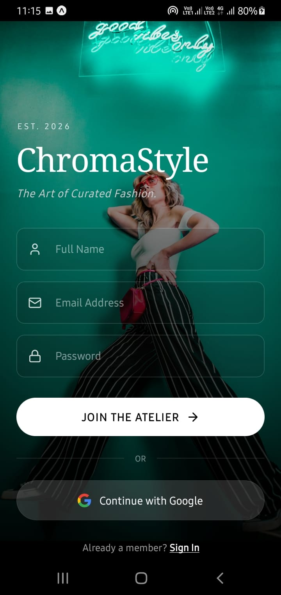
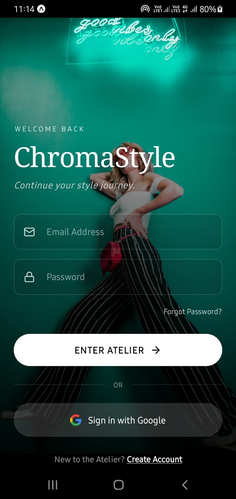
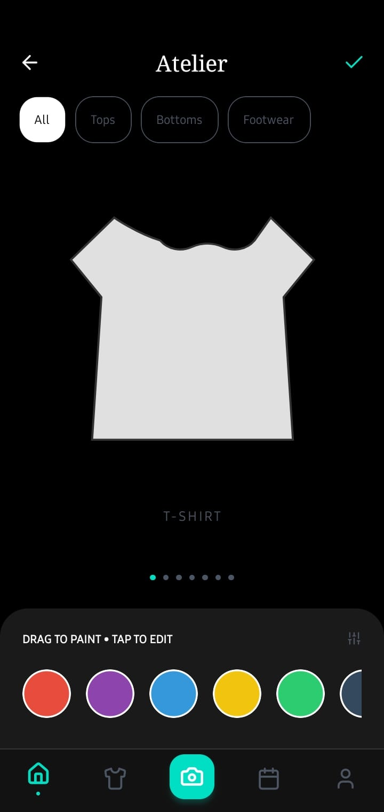
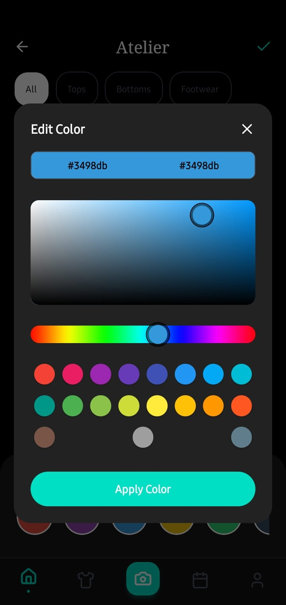
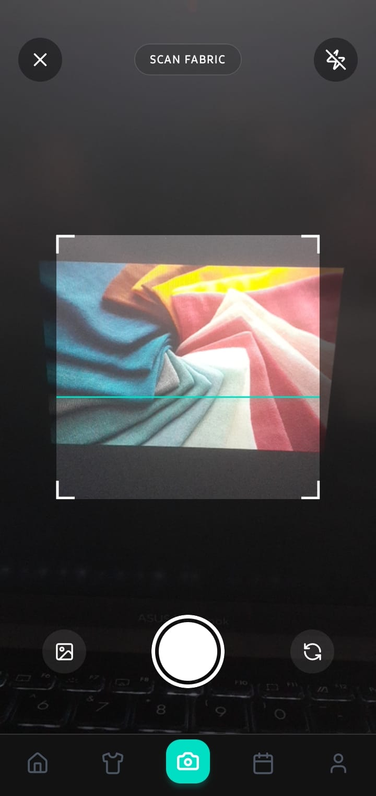
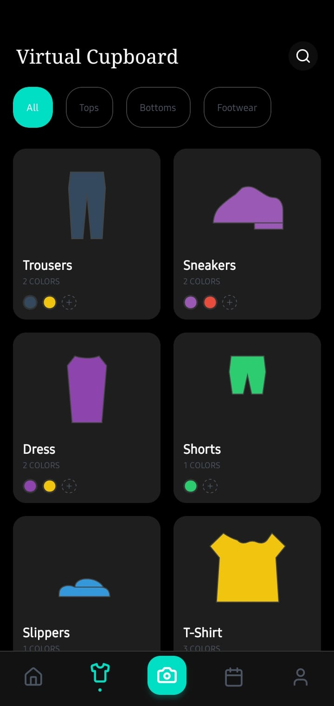
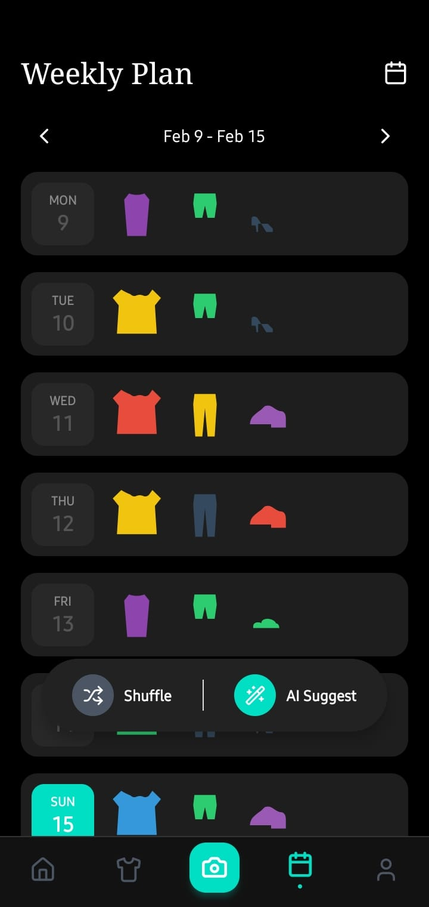
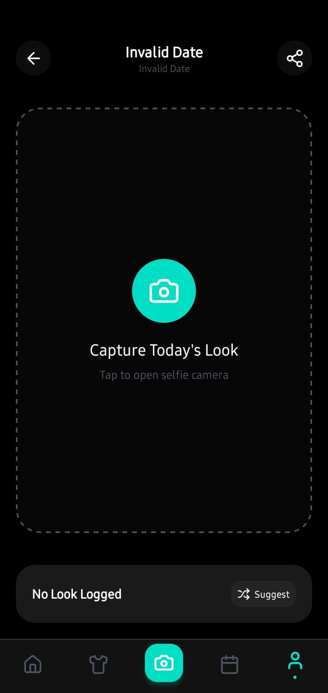

# 🎨 ChromaStyle: AI-Powered Wardrobe & Color Analysis

**ChromaStyle** is a sophisticated mobile application designed to digitize your wardrobe, analyze fabric colors using your camera, and plan your daily outfits with AI precision. Built with **React Native (Expo)** and **Firebase**, it blends high-end fashion aesthetics with powerful utility.

---

## 📱 App Overview

ChromaStyle serves as your personal digital atelier. It solves the classic **“I have nothing to wear”** problem by:

- **Digitizing your closet** — catalog your clothes by category and color
- **Smart color scanning** — detect exact fabric colors using your camera
- **Outfit logging** — track your daily style with a Selfie Log
- **Weekly planning** — organize outfits visually with AI-assisted planning

---

## ✨ Key Features

### 🎨 AI Color Scanner
Point your camera at any fabric to extract its dominant color palette:
- **Primary**
- **Vibrant**
- **Accent**

Save colors instantly to your digital wardrobe.

### 👗 Virtual Wardrobe
A visual inventory of:
- Tops
- Bottoms
- Footwear

All synced in real time with **Firebase Firestore**.

### 📅 Visual Planner
- Drag-and-drop outfits into a weekly grid
- Auto-generate outfit plans with AI assistance

### 📸 Selfie Log
A dedicated **Outfit of the Day** camera mode that:
- Saves your look to a specific date
- Builds a history of your best outfits

### ☁️ Cloud Sync
- Secure authentication with **Firebase Auth**
- Real-time cloud storage via **Firestore**

---

## 🖼️ Screenshots

|              **SignUp Screen**              |             **Login Screen**             |         **Atelier Screen**         |             **Color Picker**             |
|:--------------------------------------:|:----------------------------------------:|:----------------------------------:|:----------------------------------------:|
|  |          |  |       |
|     *Secure Firebase authentication*     | *Personalized user access* |   *Creative garment workshop*   | *Fine-tuned color selection* |


|         **Camera Screen**         |       **Virtual Cupboard Screen**        |          **Weekly Plan Screen**          |         **Outfit Screen**         |
|:---------------------------------:|:---------------------------------:|:----------------------------------------:|:---------------------------------:|
|  |      |        |  |
| *AI-powered color extraction* |  *Cloud-synced garment list*   | *Visual weekly style agenda* |  *Detailed look composition*   |


---

## 📺 Demo Video

Watch the full workflow—from scanning a shirt to planning the week:

---

## 🚀 Setup Instructions

Follow these steps to get your local development environment ready.

#### Prerequisites

To run **ChromaStyle**, ensure your system meets the following requirements:

* **Node.js**: v18.0.0 or higher.
* **Package Manager**: npm (comes with Node) or Yarn.
* **Expo CLI**: Install globally to manage the build process:
    ```bash
    npm install -g expo-cli
    ```
* **JDK 17**: Specifically version 17 is required for Android/Gradle builds to avoid class version errors.
* **Android Studio**: Required for managing the Android Emulator and SDK platforms.
* **Firebase Account**: Access to a project with Authentication and Firestore enabled.

#### 1. Clone the Repository
```bash
git clone https://github.com/Chamith-Bhanuka/ChromaStyle.git
````
```bash
cd chromastyle
```
#### 2. Install Dependencies
```bash
npm install
```
#### 3. Firebase Configuration
1. Navigate to the Firebase Console.

2. Enable Email/Password under the Authentication tab.

3. Create a Cloud Firestore database in Production Mode.

4. Apply the following Security Rules to ensure users can only access their own wardrobe:

```bash
rules_version = '2';
service cloud.firestore {
  match /databases/{database}/documents {
    match /users/{userId} {
      allow read, write: if request.auth != null && request.auth.uid == userId;
      match /wardrobe/{itemId} {
        allow read, write: if request.auth != null && request.auth.uid == userId;
      }
    }
  }
}
```
5. Create a services/firebase.ts file in your project and populate it with your Web SDK configuration keys.

#### 4. Run the Application
Since the AI Color Scanner relies on native code, you must use a Development Build rather than Expo Go.

**Android (Emulator or Physical Device):**
```bash
npx expo run:android
```

**iOS (Simulator - Mac Only):**
```bash
npx expo run:ios
```

---

## 🛠️ Tech Stack

**Frontend:** React Native (Expo SDK 52)


* **Styling:** NativeWind (Tailwind CSS) \& Reanimated


* **State Management:** Zustand with Persist Middleware


* **Backend:** Firebase (Auth \& Firestore)


* **Native Modules:** Expo Camera, Image Manipulator, \& React Native Image Colors

---

## 🏗️ System Architecture

ChromaStyle utilizes a robust Service-Store Architecture to maintain a fast UI and a reliable backend:


1. **Service Layer (/services):** Contains pure Firebase logic. These functions handle asynchronous calls to the Cloud Firestore without knowing about the application state.

2. **Store Layer (/store):** Managed by Zustand. This layer performs Optimistic Updates, meaning it updates the local UI immediately so the app feels fast, then syncs with the Service Layer in the background.

3. **Constants Layer (/constants):** Centralizes garment metadata and SVG paths. This structure prevents circular dependencies between the Store and the Services.

---

## 📦 Download Build
You can download the latest pre-compiled build for testing on Android devices here:

[⬇️ Download ChromaStyle v1.0.0 (APK)](https://github.com/Chamith-Bhanuka/)

---

## 📝 License
This project is licensed under the MIT License. See the LICENSE file for details.